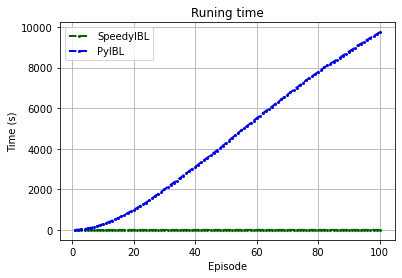
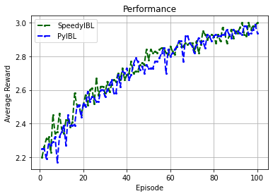
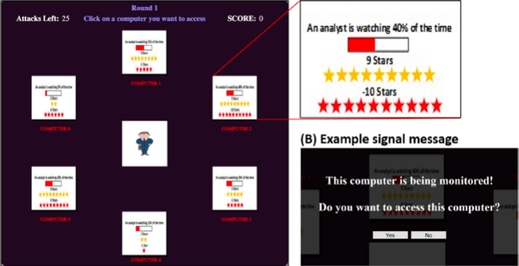
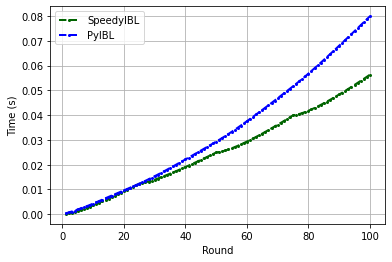
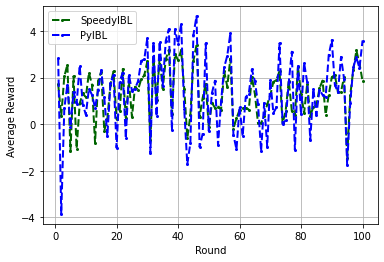

# SpeedyIBL Library and Applications

A Python library to create single or multi Instance-based Learning (IBL) agents that are built based on Instance Based Learning Theory (IBLT) <sup id="a1">[1](#f1)</sup>


* [Installation](#installation)
* [Applications](#applications)
  * [Cooperative Navigation Task](#Cooperative-Navigation-Task)
  * [Insider Attack Game](#Insider-Attack-Game)

Please use this bibtex if you want to cite this repository in your publications:
```
@misc{speedy_ibl,
  author = {Thuy Ngoc, Nguyen and Duy Nhat, Phan and Cleotilde, Gonzalez},
  title = {Speedy IBL Implementation and its Applications},
  year = {2021},
  publisher = {Technical report, Carnegie Mellon University}
}
```

# Installation
1. To download all the examples, simply clone this repository:
```
git clone https://github.com/nhatpd/SpeedyIBL.git
```

2. Goto the main folder of the cloned git repository which contains the `requirements.txt` file

3. (suggestion) Create a virtual Python Environment by running the following commands in your shell. (This may be different on your machine!  If it does not work, look at how to install a virtual python env_speedyIBL based on your system.):
```
python3 -m venv env_speedyIBL
```
```
source env_speedyIBL/bin/activate
```
4. Install the required python libraries by running this command in your shell:
```
pip install -r requirements.txt
```

# Applications
This repo is designed to provide examples of how to use SpeedyIBL to create IBL agent(s) for a wide range of tasks from single-agent to multi-agent task settings.

## Cooperative Navigation Task
This is a multi-agent scenario. As demonstrated in the figure below, the three IBL agents are playing the task. 

<p align="center">

</p>

In this task, three agents (Blue, Red and Yellow) must cooperate through physical actions to reach a set of three landmarks (3 green landmarks). The agents can observe the relative positions of other agents and landmarks, and are collectively rewarded based on the number of the landmarks that they cover. For instance, if all the agents cover only one landmark, they receive one point. By contrast, if they all can cover the three landmarks, they got the maximum of three points.
Simply put, the agents want to cover all of the landmarks, so they need to learn to coordinate the landmark they must cover.

### Running the task:
The basic structure of our commands is the following:
```
python run_navigation.py --environment NAVIGATION_V1 --type <library_name>
```
where `<library_name>` is the type of library used to run the task. Specifically `<library_name>` can be replaced with:
* `libl` to run IBL agents with SpeedyIBL
* `ibl` to run IBL agents with [PyIBL](http://pyibl.ddmlab.com/) (v.4.1.2)

The other experiment parameters can be configured by changing the values in `run_navigation.py` file.

### Results:
Running time (left) and average reward (rights) of SpeedyIBL and PyIBL on Cooperative Navigation task.

<p align="center">
    </img>
    </img>
</p>

## Insider Attack Game
In this game, players take the role of the attacker and their goal is to score points by “hacking” computers to steal proprietary data, illustrated in the figure below. The game is chosen to illustrate using of the partial matching process. 

<p align="center">
</img>
</p>

### Running the task:
The basic structure of our commands is the following:
```
python insider_attack_speedyIBL.py
```

### Results:
Running time (left) and average reward (rights) of SpeedyIBL and PyIBL on Insider Attack Game.

<p align="center">
    </img>
    </img>
</p>


## References
<b id="f1">[1]</b> Cleotilde Gonzalez, Javier F. Lerch and Christian Lebiere (2003), [Instance-based learning in dynamic decision making](https://www.sciencedirect.com/science/article/abs/pii/S0364021303000314), Cognitive Science, 27, 591-635. DOI: 10.1016/S0364-0213(03)00031-4.
